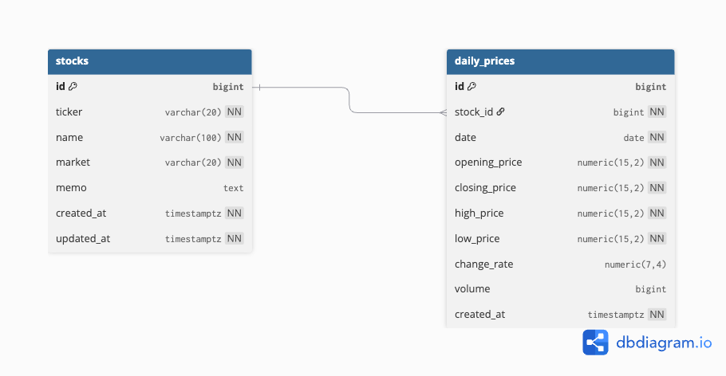

# stock-brief

매일 아침 받아보는 주식 일일 브리핑 시스템.
모던 백엔드 학습 + 이직 포트폴리오 목적의 사이드 프로젝트.

## Tech Stack

| Layer | Stack |
|---|---|
| Language | Kotlin 1.9 |
| Framework | Spring Boot 3.5.14 |
| Build | Gradle (Kotlin DSL) |
| JDK | Temurin 21 (LTS) |
| DB | PostgreSQL 16 (Docker) |
| ORM | Spring Data JPA + QueryDSL (planned) |
| Lint | ktlint |
| Infra | AWS EC2, Docker Compose |
| AI | AWS Bedrock + Spring AI (planned) |

## Getting Started

### Prerequisites

- JDK 21 (Temurin recommended)
- Docker Desktop

### Run

```bash
# 1. PostgreSQL 컨테이너 띄우기
docker compose up -d

# 2. Spring Boot 앱 실행
./gradlew bootRun
```

또는 IntelliJ에서 `StockBriefApplication.kt` 실행.

### Endpoints

- App: http://localhost:8080
- DB:  localhost:5432 (user: `stockbrief`, password: `stockbrief`)

## Database ERD (Phase 0)



- **stocks**: 사용자가 관심 등록한 종목 (개별 주식 + ETF 통합 관리)
- **daily_prices**: 매일 자동 수집되는 일별 가격 (OHLC + 변동률 + 거래량)

전체 정의: [`docs/erd.dbml`](docs/erd.dbml) (DBML 형식, [dbdiagram.io](https://dbdiagram.io)에 붙여넣어 시각화 가능)

## Roadmap

- [x] **Phase 0**: 환경 셋업 (Spring Boot + PostgreSQL Docker 연결, 코딩 컨벤션, ERD)
- [ ] **Phase 0.5**: 종목 CRUD + Yahoo Finance 가격 자동 수집 + Spring Scheduler + AWS EC2 배포
- [ ] **Phase 0.7**: 별도 React + Vite 프론트엔드 ([Goyangeng/stock-brief-web](https://github.com/Goyangeng/stock-brief-web))
- [ ] **Phase 1**: 네이버 뉴스 API + AWS Bedrock LLM 요약 + Slack/이메일 알림
- [ ] **Phase 2**: DART 공시 API, 그룹 관리, Redis 캐시, Kafka 이벤트

## Conventions

- **Commit**: [Conventional Commits](https://www.conventionalcommits.org/) (`feat:`, `fix:`, `chore:`, `docs:`, ...)
- **Branch**: `feature/<name>`, `fix/<name>`, `chore/<name>`
- **Workflow**: feature branch → PR → squash merge to `main`
- **Code style**: Kotlin official style (enforced by ktlint)

## License

학습/개인 사용 (No license declared).
